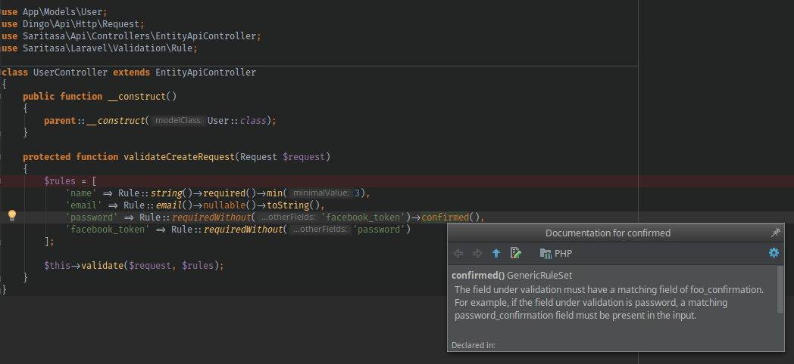
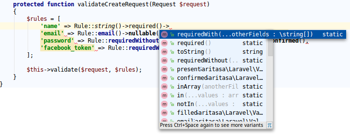

# Fluent Validation Rules builders for Laravel

[](https://travis-ci.org/Saritasa/php-laravel-fluent-validation)
[](https://codecov.io/gh/Saritasa/php-laravel-fluent-validation)
[](https://github.com/Saritasa/php-laravel-fluent-validation/releases)
[](http://www.php.net)
[](https://packagist.org/packages/saritasa/laravel-fluent-validation)

Use fluent-style syntax to build [Laravel validation rules](https://laravel.com/docs/5.4/validation#available-validation-rules)

**Example**:
```php
$rules = [
    'id' => Rule::int()->required(),
    'name' => Rule::string()->required()->minLength(3)->toString(),
    'email' => Rule::string()->required()->email()->toArray(),
    'role_id' => Rule::modelExists(Role::class),
    'salary' => Rule::int()->when($isPHPDeveloper, 
                             function($ruleWhenTrue) { 
                                 return $ruleWhenTrue->min(1000000); 
                             }, 
                             function($ruleWhenFalse) { 
                                 return $ruleWhenFalse->max(1000); 
                             }
    )
]
```
## Advantages
* Strong typing
* Intellisence for available rules and parameters (if you use smart IDE, like PHPStorm)
* Hints about mistypings (if you use smart IDE, like PHPStorm)

### Examples
**Inline documentation:**



**Inellisence:**



**Custom validation rules**

You can also use [custom declared validations](https://laravel.com/docs/5.4/validation#custom-validation-rules):

```php
$rules = [
    ... => Rule::custom('foo')
]
```


## Installation

Install the ```saritasa/laravel-fluent-validation``` package:

```bash
$ composer require saritasa/laravel-fluent-validation
```

If you use Laraval 5.4 or less,
or 5.5+ with [package discovery](https://laravel.com/docs/5.5/packages#package-discovery) disabled,
add the FluentValidationServiceProvider in ``config/app.php``:

```php
'providers' => array(
    // ...
    Saritasa\Laravel\Validation\FluentValidationServiceProvider::class,
)
```
*Note:* You can omit service provider registration, but then you must call
*->toString()* or *->toArray()* on each builder.
If service provider is registered, manual casting of rule to string or array
is not necessary and default Laravel's *Illuminate\Validation\ValidationServiceProvider::class* 
can be removed from *'providers'* array.


## Available classes

### \Saritasa\Laravel\Validation\Rule
Root of your rule builder.

## Contributing

1. Create fork, checkout it
2. Develop locally as usual. **Code must follow [PSR-1](http://www.php-fig.org/psr/psr-1/), [PSR-2](http://www.php-fig.org/psr/psr-2/)** -
    run [PHP_CodeSniffer](https://github.com/squizlabs/PHP_CodeSniffer) to ensure, that code follows style guides
3. **Cover added functionality with unit tests** and run [PHPUnit](https://phpunit.de/) to make sure, that all tests pass
4. Update [README.md](README.md) to describe new or changed functionality
5. Add changes description to [CHANGES.md](CHANGES.md) file. Use [Semantic Versioning](https://semver.org/) convention to determine next version number.
6. When ready, create pull request

### Make shortcuts

If you have [GNU Make](https://www.gnu.org/software/make/) installed, you can use following shortcuts:

* ```make cs``` (instead of ```php vendor/bin/phpcs```) -
    run static code analysis with [PHP_CodeSniffer](https://github.com/squizlabs/PHP_CodeSniffer)
    to check code style
* ```make csfix``` (instead of ```php vendor/bin/phpcbf```) -
    fix code style violations with [PHP_CodeSniffer](https://github.com/squizlabs/PHP_CodeSniffer)
    automatically, where possible (ex. PSR-2 code formatting violations)
* ```make test``` (instead of ```php vendor/bin/phpunit```) -
    run tests with [PHPUnit](https://phpunit.de/)
* ```make install``` - instead of ```composer install```
* ```make all``` or just ```make``` without parameters -
    invokes described above **install**, **cs**, **test** tasks sequentially -
    project will be assembled, checked with linter and tested with one single command

## Resources

* [Bug Tracker](http://github.com/saritasa/php-laravel-fluent-validation/issues)
* [Code](http://github.com/saritasa/php-laravel-fluent-validation)
* [Changes History](CHANGES.md)
* [Authors](http://github.com/saritasa/php-laravel-fluent-validation/contributors)
